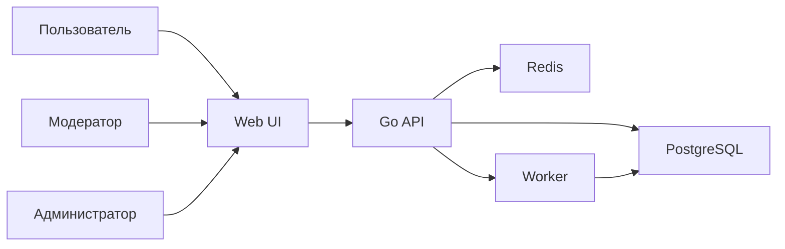

# План MVP букмекерской платформы

Источник требований: [AGENTS.md](AGENTS.md)

## 1. Границы MVP

- Только демо-режим с виртуальной валютой
- Ставки токенами на пользовательские события после модерации
- Без реальных платежей, без KYC/AML в реализации MVP
- Подписка на токены и вывод токенов реализуются ближе к финалу MVP
- Роли: гость, пользователь, модератор, администратор
- Гео-ограничения отсутствуют

## 2. Формат репозитория

- На этапе MVP используем **monorepo**: backend + frontend + docs + infra в одном репозитории.
- Причины:
  - быстрый цикл изменений API ↔ frontend,
  - единый CI/CD и quality gates,
  - единый запуск локального окружения через Docker Compose,
  - ниже операционная сложность до масштабирования команд.

## 3. Технологический стек

- Backend: Go + Gin
- DB: PostgreSQL
- Кэш и очереди: Redis
- Контейнеризация: Docker + Docker Compose
- CI/CD: GitHub Actions
- Тесты: unit, integration, e2e
- Документация: Markdown + OpenAPI

## 4. Целевая архитектура

### 4.1 Контуры

- API контур: Go (Gin) REST API
- Доменный контур: события, исходы, коэффициенты, ставки, кошелёк, модерация, settlement
- Инфраструктурный контур: PostgreSQL, Redis, worker
- Наблюдаемость: структурные логи, health/readiness

### 4.2 Mermaid схема

## 5. Структура данных PostgreSQL

### 5.1 Основные сущности

- users
  - id, email (unique), password_hash, role, status, created_at
- wallets
  - id, user_id (unique), balance_tokens, updated_at
- wallet_transactions
  - id, wallet_id, type (subscribe/withdraw/hold/release/settle), amount_tokens, ref_type, ref_id, created_at
- events
  - id, creator_user_id, title, description, category, resolve_at, status (draft/pending/approved/rejected/settled/canceled)
- event_outcomes
  - id, event_id, code (yes/no), is_winner (nullable)
- odds_snapshots
  - id, event_id, outcome_id, odds_decimal, margin_bps, created_at
- bets
  - id, user_id, event_id, outcome_id, stake, odds_at_bet, potential_payout, status (open/won/lost/refunded), idempotency_key, placed_at, settled_at
- moderation_tasks
  - id, event_id, status (pending/approved/rejected), moderator_id, reason, reviewed_at
- audit_logs
  - id, actor_user_id, action, entity_type, entity_id, payload_json, created_at

### 5.2 Ключевые ограничения и индексы

- CHECK на положительные суммы ставок и транзакций
- FK целостность между ставками, исходами и событиями
- уникальность кошелька на пользователя
- unique `(user_id, idempotency_key)` для защиты от дублей ставок
- индексы:
  - events `(status, resolve_at)`
  - bets `(user_id, placed_at desc)`
  - odds_snapshots `(event_id, created_at desc)`
  - moderation_tasks `(status, created_at)`

## 6. Backend-модули (Go)

- auth
  - регистрация, логин, JWT, RBAC middleware
- users
  - профиль, роль, статус пользователя
- wallet
  - баланс и транзакции
- events
  - создание события, просмотр, фильтрация
- moderation
  - очередь модерации, approve/reject
- bets
  - валидация, холд, идемпотентность
- odds
  - расчёт и публикация коэффициентов
- settlement
  - фиксация исхода и проводки
- audit
  - журнал критичных действий
- health
  - `/health`, `/v1/health`

## 7. API и OpenAPI

### 7.1 Публичные endpoint-группы

- Auth
  - `POST /v1/auth/register`
  - `POST /v1/auth/login`
- Events
  - `GET /v1/events`
  - `POST /v1/events`
  - `GET /v1/events/:id`
- Bets
  - `POST /v1/bets`
  - `GET /v1/bets/my`
- Wallet
  - `GET /v1/wallet`
  - `GET /v1/wallet/transactions`
  - `POST /v1/wallet/subscribe`
  - `POST /v1/wallet/withdraw`

### 7.2 Модерация и админ

- Moderation
  - `GET /v1/moderation/events`
  - `POST /v1/moderation/events/:id/approve`
  - `POST /v1/moderation/events/:id/reject`
- Admin / Settlement
  - `POST /v1/admin/events/:id/settle`

### 7.3 Правила API

- Единый формат ошибок
- Версионирование префиксом `/v1`
- Идемпотентность ставки через `Idempotency-Key`
- Валидация входа на handler/service слоях

## 8. Frontend (этап MVP)

- Каталог событий
- Карточка события
- Создание события
- Кошелёк и мои ставки
- Модерация для moderator/admin

## 9. Логика коэффициентов и расчётов

- Базовые стартовые коэффициенты
- Пересчёт по объёму ставок + маржа (`margin_bps`)
- Выплата: `payout = stake * odds_at_bet`
- Все денежные операции транзакционны и хранятся как `decimal`

## 10. Тестирование

### 10.1 Unit

- odds calculator
- wallet ledger service
- bet validation rules
- moderation decision logic

### 10.2 Integration

- PostgreSQL repositories и транзакции
- Redis queue interaction
- проверка идемпотентности ставок

### 10.3 E2E

- регистрация → создание события → модерация → ставка → settlement
- негативные кейсы: недостаточный баланс, закрытое событие, дубль idempotency key

## 11. CI/CD (GitHub Actions)

- jobs:
  - lint/vet
  - unit tests
  - integration tests (service containers)
  - build api/worker
- quality gates:
  - merge blocked при падении тестов
  - merge blocked при падении security checks

## 12. Docker и Docker Compose

- backend [Dockerfile](backend/Dockerfile) c multi-stage build
- docker compose services:
  - api
  - worker
  - postgres
  - redis
- окружение через [.env.example](.env.example)

## 13. Документация и лицензия

- [README.md](README.md)
- [docs/architecture.md](docs/architecture.md)
- [docs/api.md](docs/api.md)
- [docs/domain-rules.md](docs/domain-rules.md)
- [docs/testing.md](docs/testing.md)
- [docs/security.md](docs/security.md)
- [CONTRIBUTING.md](CONTRIBUTING.md)
- [LICENSE](LICENSE)

## 14. Пошаговый план реализации (обновлённый)

1. Зафиксировать monorepo-структуру (`backend/`, `frontend/`, `docs/`, `plans/`, `.github/`)
2. Довести Docker Compose и `.env.example` для локального старта api/worker/postgres/redis
3. Добавить SQL-миграции базовой доменной схемы
4. Реализовать auth + RBAC
5. Реализовать поток event → moderation → publish
6. Реализовать wallet ledger + bet hold/idempotency (без подписки/вывода на этом этапе)
7. Реализовать settlement
8. Покрыть unit/integration/e2e тестами для базового флоу
9. Реализовать подписку на токены и вывод токенов
10. Зафиксировать OpenAPI и обновить документацию
11. Усилить CI/CD quality gates и сборку Docker image
